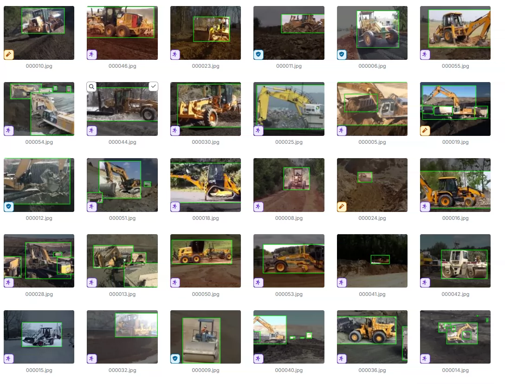
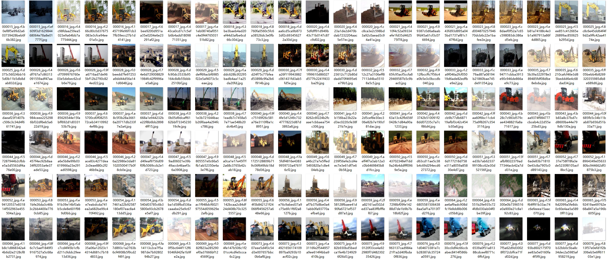
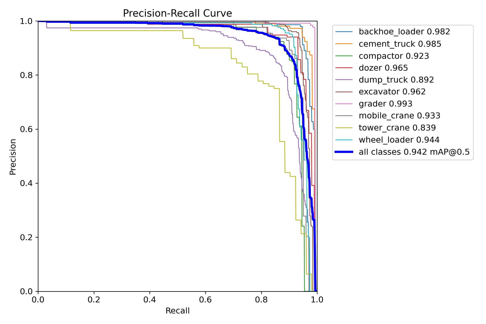
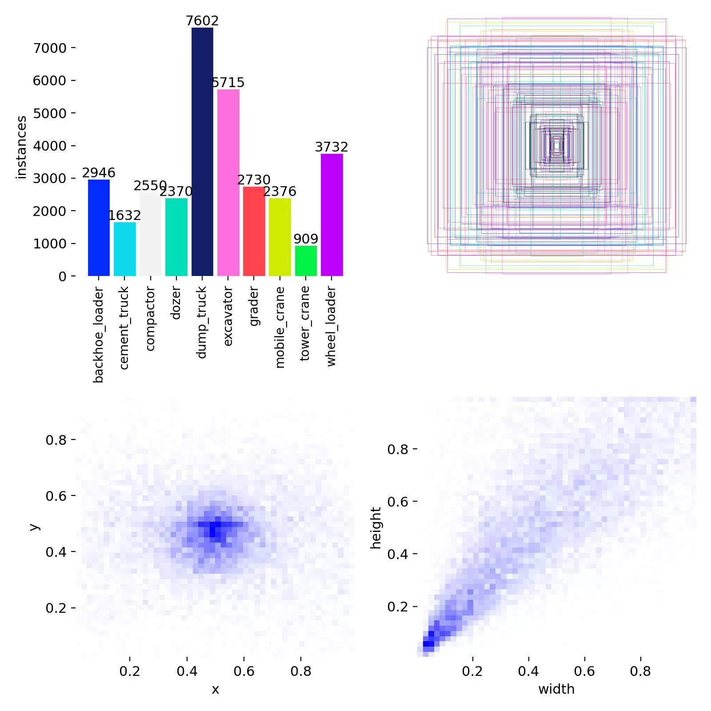
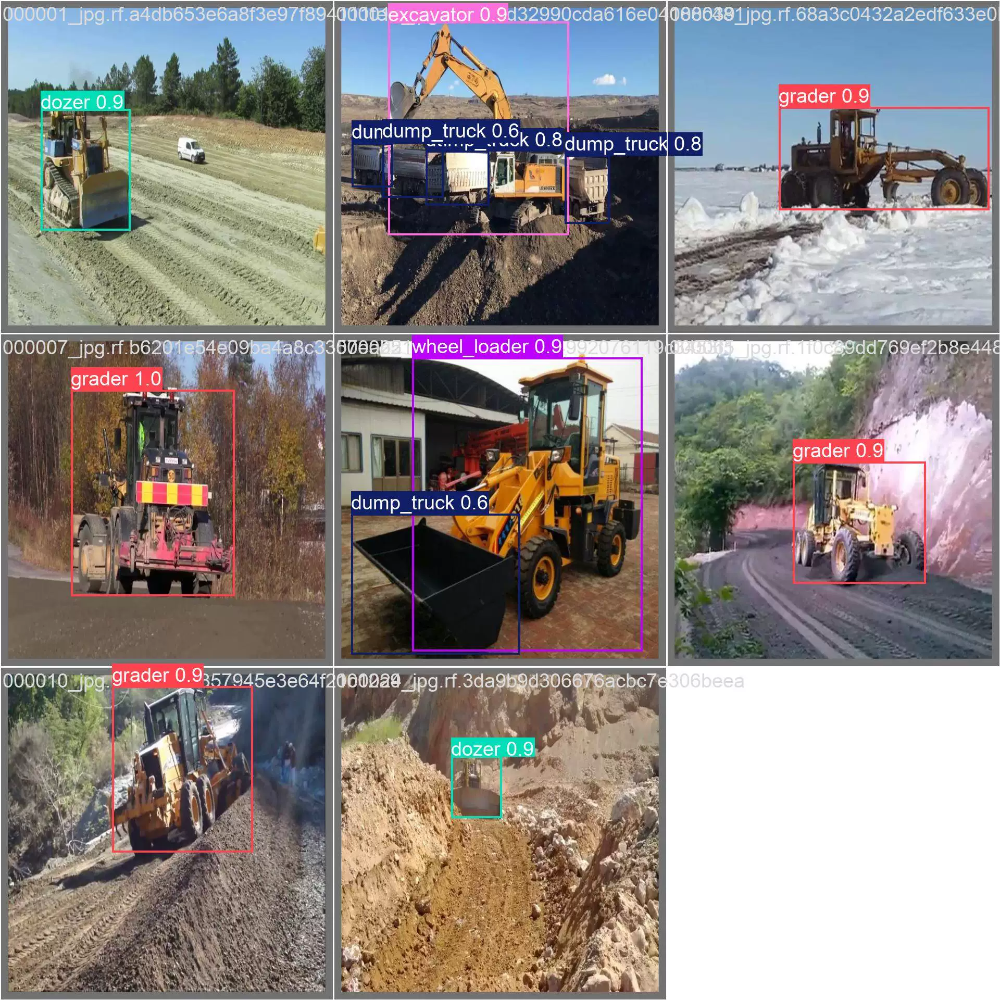
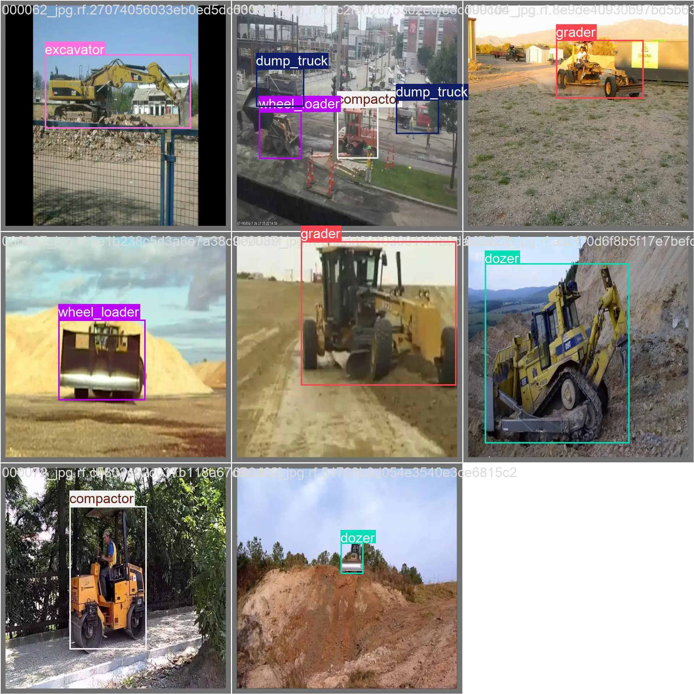

## Body

Heavy-duty engineering vehicle equipment detection dataset in YOLO format

Totally 23,801 images are available, each labeled and divided into training set (20,826), test set (990), validation set (1,985)

It is divided into 10 categories: 'backhoe_loader', 'cement_truck', 'compactor', 'dozer', 'dump_truck', 'excavator', 'grader', 'mobile_crane', 'tower_crane', 'wheel_loader'
                        Backhoe loader, cement truck, compactor, bulldozer, dump truck, excavator, grader, mobile crane, tower crane, wheel loader

Contains the YOLOv8s weight file (Training rounds 100, pre-trained model YOLOv8s.pt, mAP@0.5=0.942) with the training results file

Electronic virtual products sold without return or exchange.

## Images

item_1060832144890

Here is a pay link on Stripe ( https://buy.stripe.com/3cs8yP7sY87d0vu9AB ). Please contact me lonlonago@foxmail.com after funding $89, and I will send you a complete data files , thank you!

